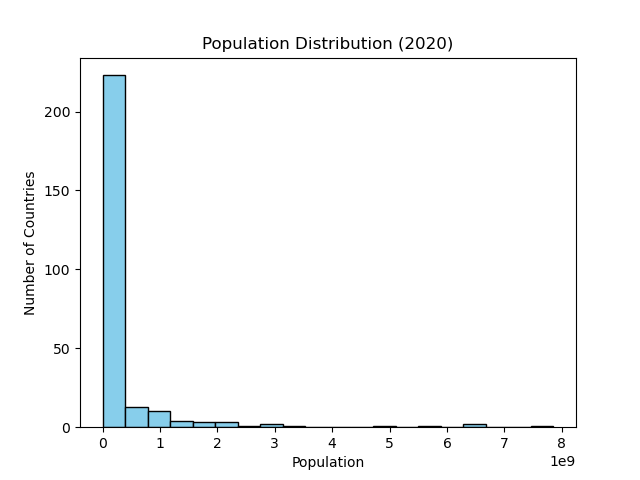

# PRODIGY_DS_Task01

## 📌 Task Description
Create a bar chart or histogram to visualize the distribution of a categorical or continuous variable, such as the distribution of ages or genders in a population.

## 📊 Dataset
World Bank Population Dataset  
Source: [World Bank Indicator - SP.POP.TOTL](https://data.worldbank.org/indicator/SP.POP.TOTL)

Raw CSV File: [API_SP.POP.TOTL_DS2_en_csv_v2_38144.csv](https://github.com/Prodigy-InfoTech/data-science-datasets/blob/main/Task%201/API_SP.POP.TOTL_DS2_en_csv_v2_38144.csv)

## 🛠️ Tools Used
- Python  
- Pandas  
- Matplotlib  

## 📈 Visualizations

### Histogram
Distribution of population values across countries (2020):

---

### Bar Chart
Top 10 countries by population (2020):

---

## 📂 Repository Structure
